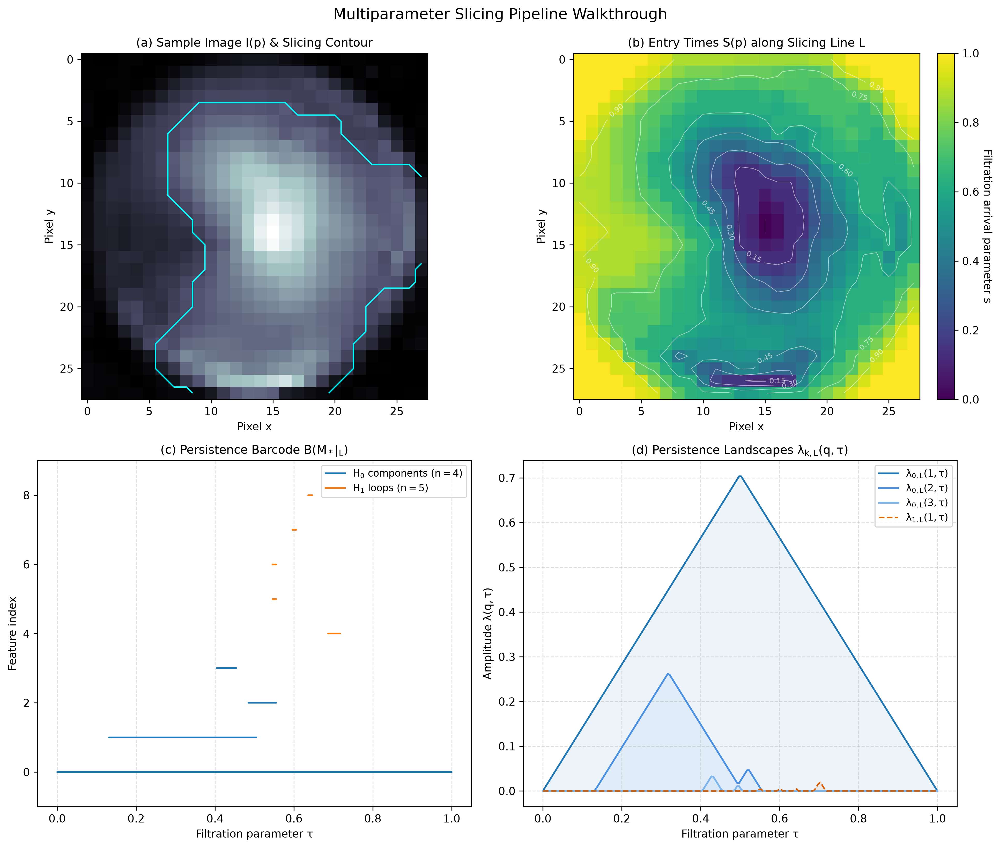

# Multiparameter Persistence on Medical Imaging: A Cubical Bifiltration Approach.

## Table of Contents
* [Getting Started](#getting-started)
* [Overview](#overview)
* [Cubical complex](#cubical-complex)
* [Cubical bifiltration](#cubical-bifiltration)
* [Multiparameter persistence](#multiparameter-persistence)
* [Medical imaging experiments](#medical-imaging-experiments)
* [References](#references)

## Getting Started

### Project Structure
```text
multiparameter_persistence/
├── assets/
│   └── pipeline_walkthrough.png
├── data/
│   └── sample_retina.png
├── notebooks/
│   └── multiparameter_persistence_demo.ipynb
├── README.md
└── requirements.txt
```
### Installation
Clone the repository and set up a virtual environment:
```
git clone https://github.com/jo12n/multiparameter_persistence.git
cd multiparameter_persistence
python -m venv .venv
source .venv/bin/activate  # On Windows (PowerShell): .\.venv\Scripts\Activate.ps1 
pip install -r requirements.txt
```

## Overview

This project studies multiparameter persistence on grid-structured data. We first introduce the topological foundations of cubical complexes [1](#ref-1) and review the algebraic framework of multiparameter persistence modules [2](#ref-2). By combining both settings, we construct a 2-parameter cubical bifiltration on 2D grayscale images based on thickened superlevel sets [3](#ref-3). To overcome the absence of discrete complete invariants in multiple parameters, we extract stable topological summaries using multiparameter persistence landscapes via slicing [4](#ref-4), implemented computationally through the GUDHI library, analyzing their structural and morphological properties on medical imaging datasets.

## Cubical complex
**Definition:** An *elementary interval* $I \subset \mathbb{R}$ is a closed interval of the form:
$$I = [k, k+1] \quad \text{or} \quad I = [k, k]$$
for some $k \in \mathbb{Z}$. An interval of the form $[k, k]$ is called *degenerate* (dimension 0), while $[k, k+1]$ is called *non-degenerate* (dimension 1).

**Definition:** Given a $d$-dimensional space, a *cube* is a product of $d$ elementary intervals:
$$C := \prod_{i=1}^{d} I_i.$$
The number of non-degenerate intervals in that product, denoted $\dim(C)$, is called the *dimension of $C$*. For $k \leq d$, a cube of dimension $k$ is called a *$k$-cube*.

**Definition:** A cube $B$ is a *face of a cube $C$*, denoted by $B \leq C$, if and only if $B \subset C$. A face $B$ is *proper* if and only if $B \ne C$.

**Definition:** A *cubical complex* $K$ of dimension $d$ is a set of cubes of a dimension at most $d$ such that the following conditions hold:
1. For any cube $C \in K$, all of its faces are also in $K$.
2. If $C_1, C_2 \in K$ and $C_1 \cap C_2 \ne \emptyset$, then $C_1 \cap C_2 \in K$.

## Cubical bifiltration

There is not yet a consensus on what the most natural or useful multifiltration is for image analysis. One promising construction, introduced by Chung, Day, and Hu [3](#ref-3), uses a second persistence parameter to thicken or erode level sets, thereby introducing sensitivity to the spatial width of morphological features.

**Definition:** Given a cubical complex $K$, the category of subcomplexes of $K$, denoted $\mathbf{Sub}(K)$, is the poset category whose objects are the subcomplexes of $K$, and whose morphisms are subcomplex inclusions $K_1 \hookrightarrow K_2$.

**Definition:** A *cubical bifiltration* of a cubical complex $K$ is a covariant functor:
$$F: (\mathcal{P}, \le) \longrightarrow \mathbf{Sub}(K)$$
from a partially ordered set $(\mathcal{P}, \le)$ into the category of subcomplexes of $K$. For any $p \le q$ in $\mathcal{P}$, the functor assigns an inclusion of subcomplexes $F(p) \hookrightarrow F(q)$. In our setting, $\mathcal{P} = \mathbb{R}^{\mathrm{op}} \times \mathbb{R}$, equipped with the partial order $(a_1, t_1) \le (a_2, t_2) \iff a_1 \ge a_2 \text{ and } t_1 \le t_2$.

**Definition:** Let $(X, d)$ be a metric space and $f: X \to \mathbb{R}$ a continuous function. For parameters $(a, t) \in \mathbb{R}^2$, the *thickened superlevel set* $S_{a, t} \subset X$ is defined by:
$$S_{a, t} = \begin{cases} \{ y \in X \mid d(y, f^{-1}[a, \infty)) \le t \} & \text{if } t \ge 0, \\ \{ y \in f^{-1}[a, \infty) \mid d(y, X \setminus f^{-1}[a, \infty)) \ge -t \} & \text{if } t < 0. \end{cases}$$

**Proposition:** Let $K$ be a cubical complex embedded in $X$ such that its geometric realization satisfies $|K| \subseteq X$. The assignment:
$$F(a, t) = \{ Q \in K \mid Q \subseteq S_{a, t} \}$$
defines a valid cubical subcomplex of $K$ for each $(a, t) \in \mathbb{R}^{\mathrm{op}} \times \mathbb{R}$. Consequently, $F$ defines a cubical bifiltration:
$$F: (\mathbb{R}^{\mathrm{op}} \times \mathbb{R}, \le) \longrightarrow \mathbf{Sub}(K)$$
ensuring that if $(a_1, t_1) \le (a_2, t_2)$ (that is, $a_1 \ge a_2$ and $t_1 \le t_2$), then $F(a_1, t_1) \subseteq F(a_2, t_2)$.

### Application to 2D Digital Images

**Definition:** A *2D grayscale image* is a discrete array $\mathcal{I}: \{0, \dots, M-1\} \times \{0, \dots, N-1\} \to [0, 1]$. We identify the image domain with the metric space $X = [0, M] \times [0, N] \subset \mathbb{R}^2$ equipped with the Euclidean metric, and construct the ambient cubical complex $K$ whose top-dimensional cells ($2$-cubes) correspond to unit pixel squares:
$$K_2 = \{[i, i+1] \times [j, j+1] \mid 0 \le i < M, \, 0 \le j < N\}$$
while $1$-cubes (edges) represent unit pixel boundaries, and $0$-cubes (vertices) correspond to grid intersections $[i, i] \times [j, j]$ for $0 \le i \le M$ and $0 \le j \le N$.

**Discrete Computation via Signed Distance Transforms:**  
In computational practice, rather than constructing a continuous interpolation $f: X \to [0, 1]$, the thickened superlevel sets $S_{a, t}$ are computed directly on the discrete pixel grid:

1. For each intensity threshold $a \in [0, 1]$, we extract the discrete superlevel set of pixels $V_a = \{p \in K_2 \mid \mathcal{I}(p) \ge a\}$.

2. The spatial parameter $t \in \mathbb{R}$ is evaluated using the Signed Euclidean Distance Transform (SEDT) with respect to the boundary $\partial V_a$. Specifically, each pixel $p \in K_2$ is assigned a spatial value $D_a(p)$:
$$D_a(p) = \begin{cases} d(p, K_2 \setminus V_a) & \text{if } p \in V_a, \\ -d(p, V_a) & \text{if } p \notin V_a, \end{cases}$$
where $d(\cdot, \cdot)$ denotes the Euclidean distance between pixel centers on the grid. The discrete thickened set of pixels is then defined for all $t \in \mathbb{R}$ as:
$$V_{a, t} = \{p \in K_2 \mid D_a(p) \ge -t\}$$
which geometrically corresponds to spatial dilations for $t \ge 0$ and morphological erosions for $t < 0$.

3. The subcomplex $F(a, t) \subseteq K$ is defined as the cubical subcomplex generated by the active pixel cells $V_{a, t}$, ensuring closure under taking faces. Specifically, a lower-dimensional face $C \in K$ belongs to $F(a, t)$ if and only if it is a face of at least one thickened pixel:
$$C \in F(a, t) \iff \exists Q \in V_{a, t} \text{ such that } C \le Q$$
This combinatorial formulation directly mirrors the standard construction from top-dimensional cells, where lower-dimensional faces enter the filtration alongside the earliest incident pixel.

## Multiparameter persistence

The classical theory of persistent homology is well developed for topological spaces filtered by a single parameter. Under these conditions, because the parameter space is a totally ordered set, every pointwise finite-dimensional persistence module decomposes uniquely into a direct sum of interval modules, yielding the persistence barcode as a complete discrete invariant. In contrast, when extending the framework to multiparameter persistence, the parameter space is only partially ordered, and no such discrete complete invariant exists. To overcome this limitation, Lesnick and Wright introduced the *fibered barcode*, which samples the multiparameter module along monotone lines compatible with the poset partial order, each forming a totally ordered subposet that yields a well-defined one-dimensional barcode.

**Definition:** Given the cubical bifiltration $F: (\mathbb{R}^{\mathrm{op}} \times \mathbb{R}, \le) \to \mathbf{Sub}(K)$ and a field $\mathbb{k}$, the *$k$-th multiparameter persistence module associated with the image* is the composite covariant functor:
$$\mathcal{M}_k = H_k(-; \mathbb{k}) \circ F: (\mathbb{R}^{\mathrm{op}} \times \mathbb{R}, \le) \longrightarrow \mathbf{Vect}_{\mathbb{k}}$$
which assigns:
- To each parameter pair $(a, t)$, the homology vector space $\mathcal{M}_k(a, t) = H_k(F(a, t); \mathbb{k})$.
- To each order relation $(a_1, t_1) \le (a_2, t_2)$, the linear map induced by the inclusion morphism:
$$\iota_* : H_k(F(a_1, t_1); \mathbb{k}) \longrightarrow H_k(F(a_2, t_2); \mathbb{k})$$

**Definition:** Let $\mathcal{L}$ denote the family of lines in $\mathbb{R}^{\mathrm{op}} \times \mathbb{R}$ that form totally ordered subposets (chains) under the partial order $\le$. Each line $L \in \mathcal{L}$ is parameterized by an order-preserving isometric path $\iota_L: (\mathbb{R}, \vert{}\cdot\vert{}) \longrightarrow (\mathbb{R}^{\mathrm{op}} \times \mathbb{R}, \Vert{}\cdot\Vert{}_\infty)$ such that $s_1 \le s_2 \implies \iota_L(s_1) \le \iota_L(s_2)$. The restriction
$$\mathcal{M}_k|_L := \mathcal{M}_k \circ \iota_L : (\mathbb{R}, \le) \longrightarrow \mathbf{Vect}_\mathbb{k}$$
defines a pointwise finite-dimensional 1-parameter persistence module, admitting a standard barcode decomposition $\mathcal{B}(\mathcal{M}_k|_L)$. The *fibered barcode* of $\mathcal{M}_k$ is the collection:
$$\{\mathcal{B}(\mathcal{M}_k|_L) \mid L \in \mathcal{L}\}$$

**Definition:** Given the fibered barcode $\{\mathcal{B}(\mathcal{M}_k|_L) \mid L \in \mathcal{L}\}$ of the $k$-th persistence module $\mathcal{M}_k$, the *multiparameter fibered persistence landscape* of $\mathcal{M}_k$ is defined as the collection $\{\lambda_{k, L} \mid L \in \mathcal{L}\}$, where each $\lambda_{k, L}: \mathbb{N} \times \mathbb{R} \to [0, \infty)$ is the 1D persistence landscape associated with the line $L$, given by:
$$\lambda_{k, L}(q,\tau) = \sup \{ h \ge 0 \mid [\tau - h, \tau + h] \subseteq I \text{ for at least } q \text{ distinct intervals } I \in \mathcal{B}(\mathcal{M}_k|_L) \}$$

> **Remark on Essential Classes:** In computational implementations, classes with infinite persistence (such as the essential class in $H_0$ where $d = \infty$) are capped at the maximum filtration parameter along the slicing trajectory (in this project, $d = s_{\max} = 1.15$). This truncation ensures that all landscape functions $\lambda_{k, L}(q, \tau)$ maintain compact support on the evaluated domain.

### Computational Pipeline and Practical Scope

In practical applications of multiparameter TDA, the theoretical framework is typically deployed across datasets by sampling a finite dictionary of admissible lines $\{L_1, \dots, L_r\} \subset \mathcal{L}$. For each line, one computes the 1D barcodes and samples the resulting landscapes over a regular grid. Flattening and concatenating these evaluations produces a global feature vector $v \in \mathbb{R}^D$ per image, which can then be fed into dimensionality reduction techniques (such as PCA or UMAP) or supervised classifiers.

**Scope of this project:**  
Rather than deploying a large-scale benchmarking or classification pipeline, this repository focuses on providing a self-contained, illustrative implementation of the mathematical framework on 2D medical data. Specifically, the workflow implemented here consists of:
1. Constructing the ambient cubical complex $K$ from a sample medical image and evaluating the discrete bifiltration via the Signed Euclidean Distance Transform (SEDT).
2. Selecting a representative admissible slicing line $L \in \mathcal{L}$, tracing a specific balance between intensity thresholding and morphological scale. In this project, $$L(s) = (a_0 - s \cdot v_a, \, t_0 + s \cdot v_t), \quad s \in [s_{\min}, s_{\max}],$$ with $v_a = 0.75$, $v_t = 4.0$, $a_0 = 0.85$ and $t_0 = -1.5$.
3. Computing the restricted 1-parameter persistence module $\mathcal{M}_k\vert{}_L$ using $\mathbb{Z}/2\mathbb{Z}$ coefficients for $k \in \{0, 1\}$ via the **GUDHI** library cubical complex engine (`gudhi.CubicalComplex`).
4. Extracting, vectorizing, and visualizing the resulting 1D persistence landscape $\lambda_{k, L}$ along this trajectory using GUDHI vector representations (`gudhi.representations.Landscape`).

This minimal proof of concept validates the end-to-end homological pipeline and illustrates the morphological behavior of the bifiltration without the computational overhead of full-grid multi-slice vectorization.

## Medical imaging experiments

To illustrate the mathematical pipeline, the companion notebook (`notebooks/multiparameter_persistence_demo.ipynb`) runs the complete workflow on a 2D sample from the RetinaMNIST dataset ($28 \times 28$ pixels) [5](#ref-5).



### Topological Interpretation of the Sliced Filtration

1. **Morphological Subcomplex Evolution:** The Signed Euclidean Distance Transform (SEDT) on superlevel sets $V_a$ produces a monotone inclusion sequence along the slicing line $L(s) = (a(s), t(s))$. High thresholds combined with spatial erosion ($t < 0$) isolate the brightest anatomical focal points, while subsequent dilation ($t > 0$) progressively fuses adjacent components. In panel (a), the cyan contour highlights the intermediate thickened boundary $V_{a, t}$ evaluated along the slicing line at $s = 0.60$, corresponding to $(a, t) = (0.40, 0.90)$.
2. **Persistence Barcode ($\mathcal{B}(\mathcal{M}_k\vert{}_L)$):** 
   - In degree $k = 0$, the barcode identifies an essential class spanning the full filtration parameter alongside a prominent finite bar, capturing the persistent secondary focal component before merging into the connected background. Shorter bars correspond to localized intensity fluctuations.
   - In degree $k = 1$, transient micro-loops appear within a narrow window ($\tau \in [0.55, 0.72]$). Due to the discrete $28 \times 28$ lattice resolution, these features represent short-lived topological boundary fluctuations rather than macroscopic vascular loops.
3. **Bubenik Persistence Landscapes ($\lambda_{k, L}$):** The evaluated landscape curves directly reflect this hierarchy. In $\lambda_{0, L}$, layers $q = 1$ and $q = 2$ exhibit clear non-zero support capturing multi-component coexistence, while $q = 3$ displays minor local peaks. In contrast, $\lambda_{1, L}$ presents near-zero amplitude, quantitatively distinguishing dominant biological features from discretization artifacts. Furthermore, for landscape layers $q \ge 4$, $\lambda_{0, L}(q, \tau) = 0$ over the evaluated domain.

## References

<a id="ref-1"></a>
[1] Wagner, H., Chen, C., & Vuçini, E. (2011). Efficient computation of persistent homology for cubical data. In Topological methods in data analysis and visualization II: theory, algorithms, and applications (pp. 91-106). Berlin, Heidelberg: Springer Berlin Heidelberg.

<a id="ref-2"></a>
[2] Botnan, M. B., & Lesnick, M. (2023). An introduction to multiparameter persistence. Representations of algebras and related structures, 77-150.

<a id="ref-3"></a>
[3] Chung, Y. M., Day, S., & Hu, C. S. (2022). A multi-parameter persistence framework for mathematical morphology. Scientific reports, 12(1), 6427.

<a id="ref-4"></a>
[4] Vipond, O. (2020). Multiparameter persistence landscapes. Journal of Machine Learning Research, 21(61), 1-38.

<a id="ref-5"></a>
[5] Yang, J., Shi, R., Wei, D., Liu, Z., Zhao, L., Ke, B., Pfister, H., & Ni, B. (2023). MedMNIST v2: A large-scale lightweight benchmark for 2D and 3D biomedical image classification. Scientific Data, 10(1), 41.